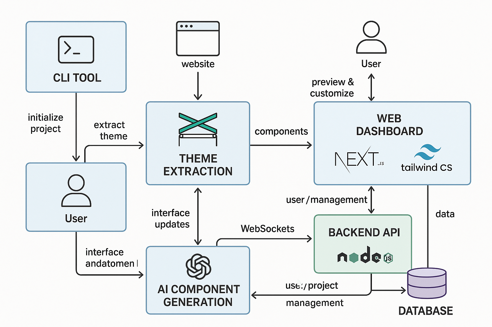

# PromptKit - Custom components CLI tool 

The project aims to build a modern, customizable UI library platform that empowers developers to quickly generate and integrate high-quality, theme-consistent UI components into their projects. Its key features and goals are:

- **Custom Component Generation:**
Developers can generate React (and potentially other framework) components tailored to their needs, using either direct inspiration from existing websites or by specifying design themes and requirements.
- **Automated Theme Extraction:**
Users can provide a website URL, and the system will analyze the site's styles (colors, typography, spacing, etc.) to extract a design theme, which can then be applied to all generated components.
- **CLI Tooling:**
A command-line interface (CLI) allows developers to:
    - Initialize new projects with the custom UI system.
    - Extract themes from websites.
    - Add, customize, and preview components before integrating them.
    - Seamlessly copy generated code into their codebase.
- **Web Dashboard:**
A Next.js-based web UI provides:
    - Live previews of components with the selected or extracted theme.
    - The ability to tweak, review, and copy component code visually before adding it to a project.
    - Real-time collaboration and customization features.
- **AI-Powered Generation:**
The backend leverages AI (e.g., OpenAI/Claude) to generate production-ready, accessible, and customizable component code based on user input and extracted themes.
- **Monorepo Architecture:**
The project is structured as a monorepo using Turborepo, with clear separation between the CLI, UI component library, theme extraction logic, AI integration, and the web dashboard.
- **Commercialization Ready:**
The platform is designed with scalability and monetization in mind, supporting a workflow that could be offered as a commercial SaaS or developer tool in the future.

**In summary:**
This project aims to revolutionize the way developers build and customize UI by combining theme extraction, AI-driven code generation, and a seamless CLI + web dashboard workflow—making it easy to create, preview, and integrate beautiful, consistent components into any project.

